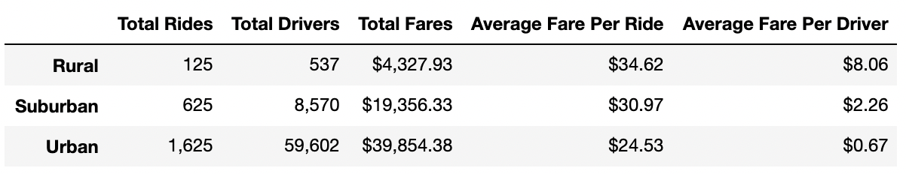
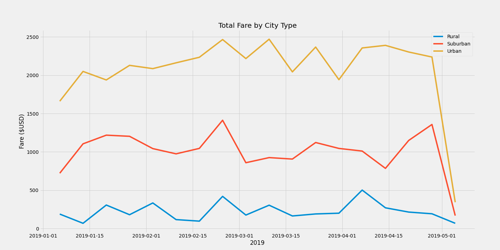

# PyBer Analysis
## Overview Of The Analysis
The purpose of this project was to perform an exploratory analysis on ride sharing data to show the relationship between the type of city and the number of drivers and riders, as well as the percentage of total fares, riders, and drivers for these city types. To perform the analysis Jupiter Notebook, Pandas, NumPy and Matplotlib was used to inspect data, merge data sets, perform calculations, and create data visualizations.

## Results
The data has shown that total rides, total drivers, and total fares are the most in urban areas and the least in rural areas. As there are less rides and drivers, the average fare per ride is the most in rural areas and for the opposite reasons it is the least in urban areas. There is approximately a 10 dollar difference between the average fare per ride between rural and urban areas, and the average fare in suburban areas lands between these two at about 5 dollars less and more respectively. The same trend is shown for average fares per drivers where this value is the largest in rural areas and close to nothing at 67 cents in urban areas. A summary of these trends can be seen in the data table below.

The relationship between city type and fares discussed above is also visualized and shown below in the line graph over the first 5 months of the year. There does not really seem to be a trend between fares and the months they are plotted against but it is definitely clear that fares are significantly higher in urban areas versus rural areas and suburban areas fall in the middle.

## Summary
Based on the results the CEO for this ride sharing company should think about completing one of the following suggestions to address disparities among the city types:
- Compensate urban drivers better since the fare per driver in these areas are so low. Maybe even take from the compensation for drivers in more rural areas to do so.
- Drivers who do more work should make more money. A potential solution is to make drivers salaried and have the salary vary based on the type of area (urban, rural, suburban) they are driving in.
- Put a cap on the prices per ride in rural areas because the average fare per ride is so high and that is not fare to the customers in those areas
